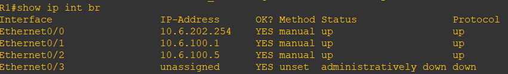
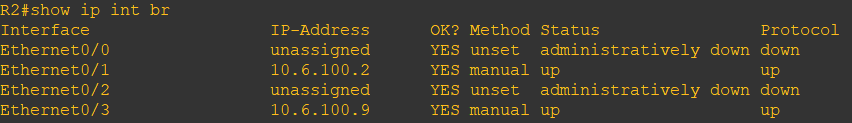
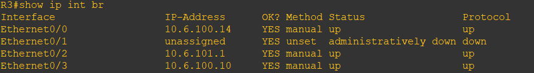
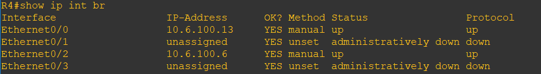
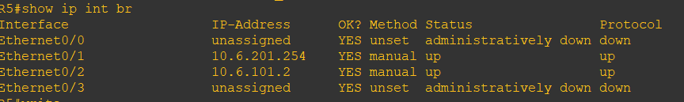
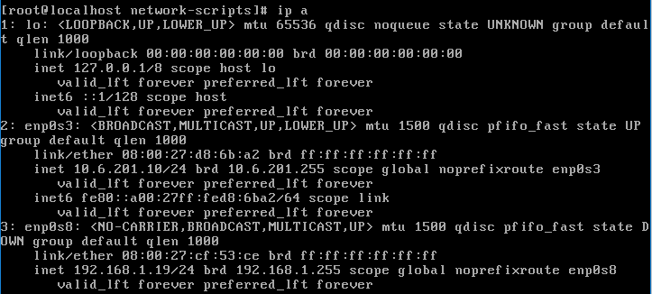
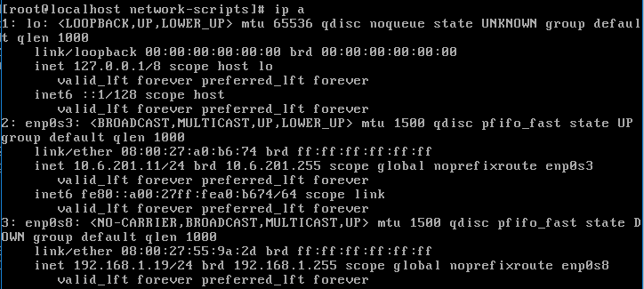
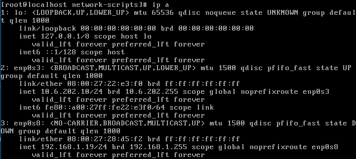

# b1-reseau-tp6 

# Lab 2 : Un peu de complexité (et d'utilité ? ...)

## Mise en place du lab

### Checklist IP Routeurs
* Definitions des IPs statique.  
Pour R1 :   
Pour R2 : 
Pour R3 : 
Pour R4 : 
Pour R5 :   

* Définition du nom de domaine.  
Pour cela il suffit juste de faire un `conf t` puis un `hostname <nom du router>`.

### Checklist VMs  
La carte nat est deja enlevé normalement.  

* Définition des IPs statiques   
Pour client1 :     
Pour client2 : 
Pour server1 :  

* Définition du nom de domaine 
Pour changer le nom de domaine des VMs il suffit de faire `echo 'nom de la vm' | sudo tee /etc/hostname` puis on eteint et rallume les VMs.  

* Remplir les fichier `hosts`  
On va dans le fichier `hosts` en faisant `cd /etc/hosts` et on rajoute l'adresse ip des vm qu'on veut ping et on écrit le nom de la vm.